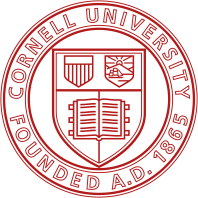
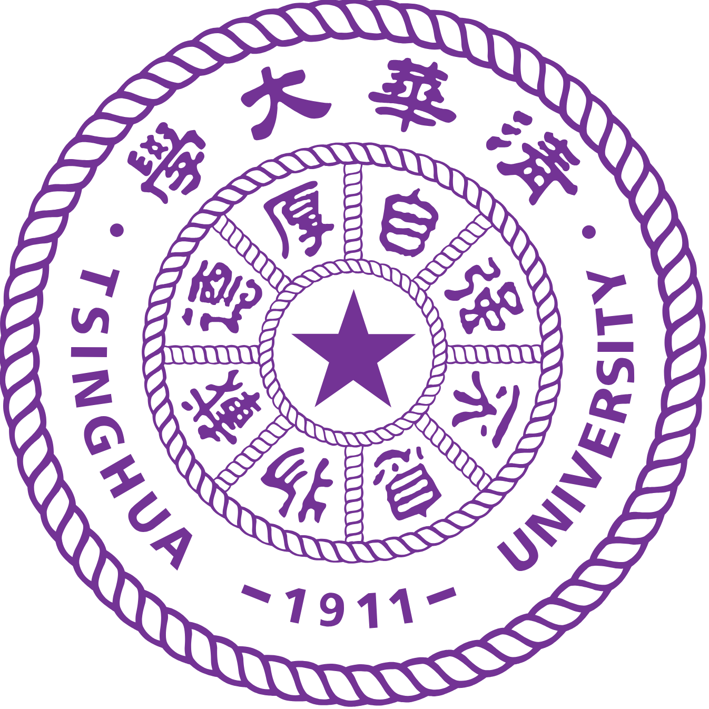

## About Me
{: #about }

I am a second-year PhD student in the [School of Operations Research and Information Engineering (ORIE)](https://www.orie.cornell.edu/) at Cornell University. I am broadly interested in understanding when modern generative learning is statistically stable and efficient. Previously, I worked on causal discovery algorithms and non-parametric statistical tests.

Before my PhD, I received my B.S. from [Weiyang College](https://www.wyc.tsinghua.edu.cn/), Tsinghua University, where I pursued a dual major in Mathematics & Physics and Civil Engineering & Systems.

I am always happy to chat — feel free to reach out via email!

## Current Research
{: #research}

My current research interests lie in the statistical foundations of generative models. In particular, I am interested in:

* Statistical properties of score estimation and diffusion models;
* Learning dynamics with machine-generated data and model collapse.

## Publications & Preprints
{: #pub }

  

    [2] MixCIT: A Kernel Based Local-Polynomial Debiased Test for Conditional Independence on Mixed-Type Data
  

  

    <strong>Mengxiao Gao</strong>, Kyra Gan, Promit Ghosal
  

  

    <a href="https://arxiv.org/abs/2607.12830v1">arXiv</a>
  

  

    [1] Hybrid Top-Down Global Causal Discovery with Local Search for Linear and Nonlinear Additive Noise Models
  

  

    Sujai Hiremath, Jacqueline R.M.A. Maasch, <strong>Mengxiao Gao</strong>,
    Promit Ghosal, Kyra Gan
  

  

    <a href="https://arxiv.org/abs/2405.14496">arXiv</a>
    <a href="https://proceedings.neurips.cc/paper_files/paper/2024/hash/f03fc3545c3cfb3aa696ad6d58eed1a7-Abstract-Conference.html">
      NeurIPS 2024
    </a>
  

## Education
{: #education }

  
  

    
Cornell University

    
Aug. 2025 – Present

    

      Ph.D. in Operations Research and Information Engineering
    

  

  
  

    
Tsinghua University

    
Sep. 2021 – Jun. 2025

    

      B.S. in Mathematics and Physics · Double Major in Civil Engineering and Systems
    

  

## Miscellaneous
{: #other }

  Some of my favorite figure skating programs:
   
  Weijing Sui / Cong Han —
  <a href="https://www.youtube.com/watch?v=3JCHh2Kcm1E">Rain in Your Black Eyes</a>
   
  Alena Kostornaia —
  <a href="https://www.youtube.com/watch?v=lm_ELKKSgLI">Twilight</a>
   
  Rika Kihira —
  <a href="https://www.youtube.com/watch?v=50ljcDzWJ_0">The Fire Within</a>

